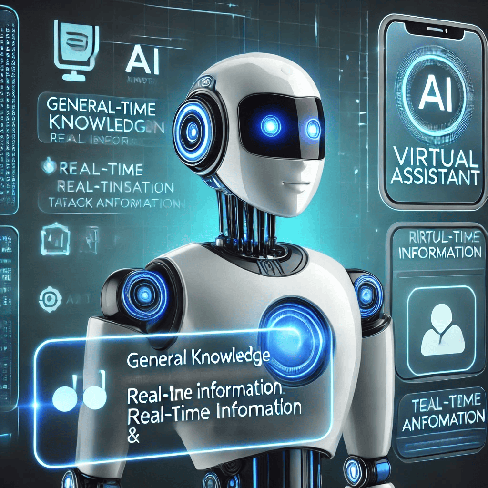

# AI Assistant

AI Assistant is an intelligent virtual assistant that is designed to handle various types of queries and tasks. This project aims to create a smart assistant capable of responding to general, real-time, and automation-related queries. It is a step towards building a fully functional AI assistant that can streamline tasks and provide useful information on the go.

## Features

- Answer basic questions on various topics.
- Fetch live data such as news or information about famous people.
- Automate tasks like opening websites or setting reminders.

## Queries

Here are some examples of the types of queries the AI Assistant can handle:

- **General Queries**: "What is photosynthesis?"
- **Real-time Queries**: "Who is Elon Musk?"
- **Automation Queries**: "Open Facebook."

## Benefits

- **Time-saving**: Automates tasks such as opening apps or setting reminders, saving you valuable time.
- **Information at your fingertips**: Provides quick access to knowledge on various topics, from general facts to real-time data.
- **Task efficiency**: Helps you get things done faster, from automating routine tasks to answering your questions on the go.

